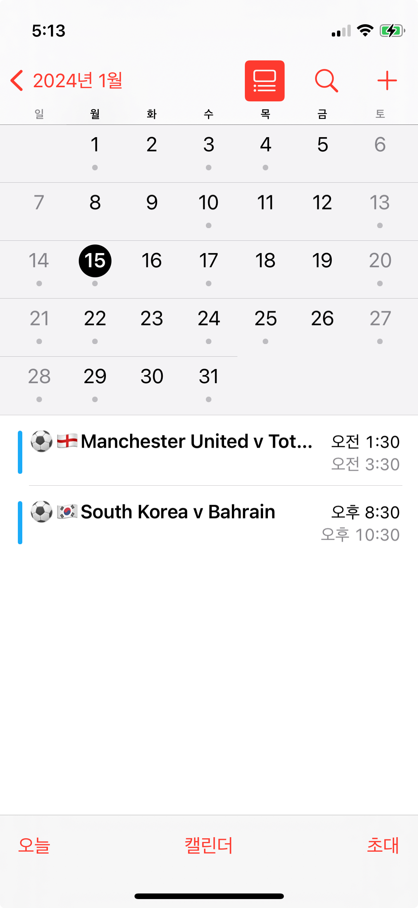

<p align="center">
  
</p>

# kfooty

Track Korean overseas football schedules.
Stay updated with the schedules of Korean football players worldwide!

## Usage

Subscribe to calendars:

```
https://kfooty.netlify.app/calendar.ics
```

|         Mac         |           iOS           |
| :-----------------: | :---------------------: |
|  |  |

## Fixtures

- ⚽️🏴󠁧󠁢󠁥󠁮󠁧󠁿 [Sonny, Tottenham](https://en.wikipedia.org/wiki/Son_Heung-min)
- ⚽️🇫🇷 [Lee Kang-in, Paris saint germain](https://en.wikipedia.org/wiki/Lee_Kang-in)
- ⚽️🇩🇪 [Kim Min-jae, bayern munich](<https://en.wikipedia.org/wiki/Kim_Min-jae_(footballer)>)
- ⚽️🇰🇷 [KFA](https://en.wikipedia.org/wiki/South_Korea_national_football_team)
